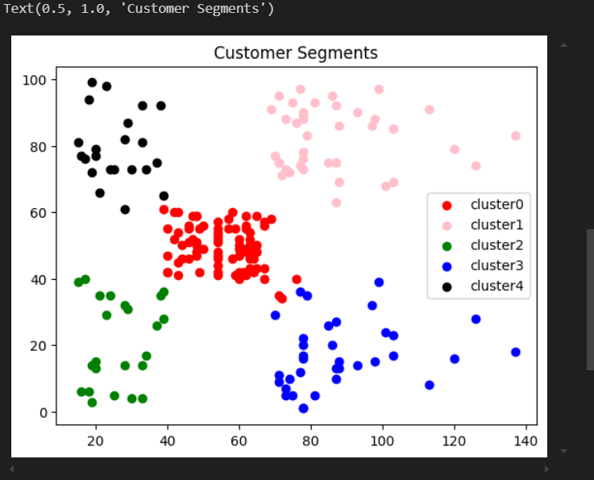

# Implementation-of-K-Means-Clustering-for-Customer-Segmentation

## AIM:
To write a program to implement the K Means Clustering for Customer Segmentation.

## Equipments Required:
1. Hardware – PCs
2. Anaconda – Python 3.7 Installation / Jupyter notebook

## Algorithm
1. Importing Necessary Liberaries
2. Data Reading and Preprocessing
3. Importing K-means algorithm from SKleearn.model
4. Ploting the Clusters

## Program:
```
/*
Program to implement the K Means Clustering for Customer Segmentation.
Developed by: Nemaleshwar H
RegisterNumber:  212223230142
*/
```
```py

import pandas as pd
import matplotlib.pyplot as plt
```
```py
data=pd.read_csv("Mall_Customers.csv")
data.head()
```
```py
data.info()
data.isnull().sum()
```
```py
from sklearn.cluster import KMeans
wcss = []
for i in range(1,11):
  kmeans = KMeans (n_clusters = i, init ="k-means++")
  kmeans.fit(data.iloc[:,3:])
  wcss.append(kmeans.inertia_)
```
```py
plt.plot(range(1,11),wcss)
plt.xlabel("no of cluster")
plt.ylabel("wcss")
plt.title("Elbow Metthod")
```
```py
km=KMeans(n_clusters=5)
km.fit(data.iloc[:,3:])
y_pred = km.predict(data.iloc[:,3:])
y_pred
```
```py
data["cluster"]=y_pred
df0=data[data["cluster"]==0]
df1=data[data["cluster"]==1]
df2=data[data["cluster"]==2]
df3=data[data["cluster"]==3]
df4=data[data["cluster"]==4]
plt.scatter(df0["Annual Income (k$)"],df0["Spending Score (1-100)"],c="red",label="cluster0")
plt.scatter(df1["Annual Income (k$)"],df1["Spending Score (1-100)"],c="pink",label="cluster1")
plt.scatter(df2["Annual Income (k$)"],df2["Spending Score (1-100)"],c="green",label="cluster2")
plt.scatter(df3["Annual Income (k$)"],df3["Spending Score (1-100)"],c="blue",label="cluster3")
plt.scatter(df4["Annual Income (k$)"],df4["Spending Score (1-100)"],c="black",label="cluster4")
plt.legend()
plt.title("Customer Segments")
```

## Output:
## DATA READING

## DATA INFO

## ELBOW GRAPH

## CLUSTER PLOT

## Result:
Thus the program to implement the K Means Clustering for Customer Segmentation is written and verified using python programming.
